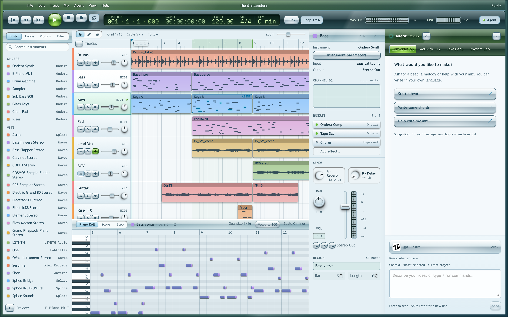
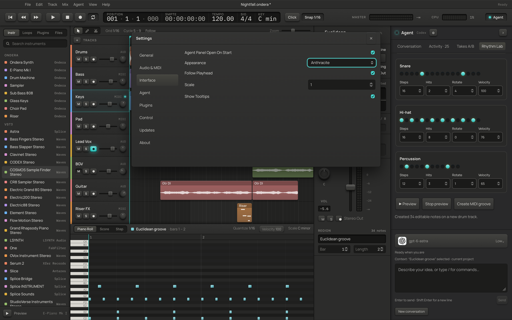

# Streaming agent, creative tools and Aero verification

15 September 2026. Development PR; no installed application replacement or release.

## Delivered behavior

- Codex app-server streaming and dynamic DAW tools; Claude partial-message streaming; bounded
  API stream parsing. Assistant deltas stay in one message even when activity is interleaved.
  Polling agent status/transcripts does not recursively add observations to the transcript.
- Markdown prose, tables, lists and code; technical activity separated from conversation.
  Generated HTML is skipped, image URLs do not fetch, and links cannot navigate the DAW.
- Account/API model discovery, provider grouping, local maker logos, search, atomic model/effort
  selection and advertised thinking modes. No hardcoded future model catalog.
- General `/diagnose` plus musical slash prompts and direct Takes/Rhythm panel commands.
- Creative Takes: save/reopen, audio-source retention, alternate edits, one-step switch/Undo.
- Rhythm Lab: Euclidean lanes, tempo-aware audio preview, editable drum track, bounded length,
  one-step Undo and headroom for combined drum hits.
- Humanize, velocity ramps, scale correction, reverse, legato and repeat; shared editor/CLI/MCP
  commands. Atomic multi-parameter plugin edits and live plugin-state capture.
- Solo/mute/fader/master/instrument audibility inspection. The reported original drum problem
  was a muted older track also left soloed; the new drum instrument and MIDI were present.
  Removing that old Solo fixed the routing exclusion without changing the new drum notes.
- Full-app Aero materials, accessible focus, readable timeline and piano roll, with a persisted
  Anthracite selector. Takes/Rhythm use the whole panel height and open at the top.

## Design reference and choices

The requested direction is Windows Vista-era Frutiger Aero. The supplied
[Frutiger Aero Archive](https://frutigeraeroarchive.org/) and its
[Vista reference](https://frutigeraeroarchive.org/images/introduction/windows_vista.jpg) were
inspected visually. The archive combines dark smoked glass, green controls and nature imagery.
[CARI](https://cari.institute/aesthetics/frutiger-aero) and the
[University of Waterloo museum](https://uwaterloo.ca/computer-museum/exhibits/frutiger-aero-future-2000s)
provide historical context.

The material study used [7.css](https://khang-nd.github.io/7.css/),
[Make Aero buttons](https://makeaero.com/button) and [window glass](https://makeaero.com/window-glass):
rounded upper reflections, a darker middle band, bright lower rim and double bevels. These are
references for original scoped CSS; no component library or remote wallpaper is bundled.
[Microsoft icon guidance](https://learn.microsoft.com/en-us/windows/win32/uxguide/vis-icons)
informs consistent toolbar lighting. [Color guidance](https://learn.microsoft.com/en-us/windows/win32/uxguide/vis-color)
informs legibility.

The design applies that vocabulary to a DAW: smoked teal/green frames, a prominent green Play
orb, silver secondary controls, pastel regions and opaque pearl editing surfaces. The type
stack prefers Segoe UI / Trebuchet for this theme. The original Anthracite tokens are restored
exactly when selected. The official
[Anthropic frontend-design skill](https://github.com/anthropics/skills/tree/main/skills/frontend-design)
was installed and used for the visual review. Provider SVGs are local assets from
[Lobe Icons](https://github.com/lobehub/lobe-icons), with their MIT license included.

## Verification performed

- `cargo fmt --all --check` and workspace Clippy with `-D warnings`: pass.
- `cargo test --workspace --locked -- --test-threads=4`: **218 passed**, two ignored tests
  (one connected-account discovery test and an existing doctest). The discovery test was also
  run explicitly against the actual connection.
- `npm --prefix frontend test`: **50 passed / 9 files**. Production TypeScript/Vite build passes.
  Vite reports an advisory main-chunk size warning (approximately 552 kB before gzip).
- Workspace debug build passes. Rust tests cover malformed/truncated streams, rejected partial
  tool requests, interleaved activity, bidirectional JSON-RPC ID collisions, atomic plugin edits, save/reopen/Undo of takes, MIDI
  transformation invariants and exhaustive Euclidean pulse counts/spacing.
- Dedicated `/tmp/Ondera QA.app` and private data/settings/control directory isolate live tests
  from the installed application and the user's project.
- Real Codex account: discovered five available models and their reasoning levels. Actual
  no-tool French reply sampled 85 times: 48 distinct positive text lengths (24 to 1,708
  characters), one final assistant message, no duplicate fragments, no technical tool entries,
  no error. Reasoning text is not exposed.
- Real Codex tool turn after the JSON-RPC fix: created exactly one Drum Machine MIDI track,
  one bar and four kick notes (pitch 36, velocity 90, beats 0/1/2/3), then inspected routing.
  Independent comparison confirmed the original tracks, clips, strips and sources were preserved.
- Native UI: checked Markdown headings/lists, model logos and catalog, Rhythm Lab preview,
  creation of 34 MIDI notes, and immediate Aero/Anthracite switching. Screenshots were inspected.
- Full song workflow through MCP and CLI using stock instruments: passed. Repeated with real
  **FabFilter Micro VST3**: 5 tracks, 17 clips, 384 notes, effects, automation, edit/Undo/Redo,
  save/reopen, MIDI export, WAV, range export and aligned stems. Full mix peak **0.65045**,
  RMS **0.13844**; range and stems report zero clipped samples. Project validation passed.
- Dedicated rhythm export test checks non-silent samples and zero clipping. Physical speaker
  audibility is not measured by these tests.

## Limits to assess during review

- Claude Code was signed out on this machine. Other cloud API accounts were not available for
  live inference. Their stream parsing and UI behavior have automated coverage; configuration
  is not evidence of successful paid-provider inference.
- Model listings are the source of truth. APIs that omit reasoning capabilities offer only
  provider default. This includes ordinary OpenAI `/models` responses without such metadata.
- One compatible server configuration is stored at a time; no simultaneous multi-endpoint
  profile manager is included. Codex keychain-only credentials need file-backed sign-in.
- External plugin parameters/state/presets use the host interfaces. The VST3 result above does
  not establish compatibility with every AU/VST3/CLAP plugin or arbitrary proprietary GUI.
- Creative takes are limited to eight and 32 MiB of metadata. Audio sources remain shared.
  Rhythm preview is limited to four bars / 30 seconds; creating MIDI supports up to 16 bars.
- Cross-platform CI is separate evidence from the local Apple Silicon checks. Existing gaps
  such as elastic audio, full comping and comprehensive latency compensation are not claimed
  as implemented. This PR expands usable workflows; it does not claim complete FL/Live/Logic parity.
